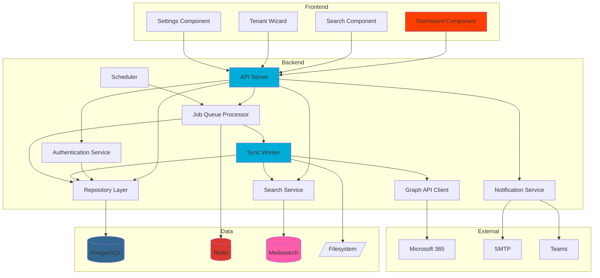

## Components

IronArchive's architecture is composed of logical components across both frontend and backend, each with clearly defined responsibilities.

### API Server

**Responsibility:** HTTP request handling, authentication, routing, and response formatting

**Key Interfaces:**
- `POST /api/v1/auth/login` - User authentication
- `GET /api/v1/tenants` - Multi-tenant management
- `GET /api/v1/search` - Email search queries
- `POST /api/v1/exports` - Export job creation

**Dependencies:** Database (PostgreSQL), Cache (Redis), Search Engine (Meilisearch), Job Queue (Redis/asynq)

**Technology Stack:** Go 1.24, Fiber v3, JWT middleware, CORS middleware, structured logging (Zap)

### Sync Worker

**Responsibility:** Email synchronization from Microsoft Graph API, attachment deduplication, filesystem storage, search indexing

**Key Interfaces:**
- `SyncMailbox(mailboxID)` - Full or incremental sync
- `ProcessDeltaQuery(mailboxID, deltaToken)` - Incremental updates
- `DeduplicateAttachment(hash)` - SHA-256 based deduplication

**Dependencies:** Microsoft Graph API client, Database, Filesystem, Meilisearch, Redis job queue

**Technology Stack:** Go 1.24, msgraph-sdk-go, asynq worker, crypto/sha256

### Job Queue Processor

**Responsibility:** Background job orchestration, retry logic, progress tracking, job status management

**Key Interfaces:**
- `EnqueueJob(type, params)` - Add job to queue
- `DequeueJob()` - Process next job
- `UpdateJobProgress(jobID, progress)` - Track progress

**Dependencies:** Redis (job queue), Database (job persistence)

**Technology Stack:** Go 1.24, asynq library, Redis client

### Scheduler

**Responsibility:** Automated 4x daily sync triggers, retention policy cleanup, scheduled exports

**Key Interfaces:**
- `ScheduleSync(cron)` - Configure sync schedule
- `TriggerRetentionCleanup()` - Execute retention policies

**Dependencies:** Job Queue, Database

**Technology Stack:** Go 1.24, robfig/cron or pg_cron extension

### Microsoft Graph API Client

**Responsibility:** OAuth2 authentication, Graph API communication, rate limit handling, token management

**Key Interfaces:**
- `GetAccessToken(tenantID)` - OAuth2 client credentials flow
- `ListMailboxes(tenantID)` - Discover mailboxes
- `GetEmailDelta(mailboxID, deltaToken)` - Fetch emails
- `DownloadAttachment(messageID, attachmentID)` - Retrieve attachment content

**Dependencies:** Microsoft Graph API (external)

**Technology Stack:** Go 1.24, msgraph-sdk-go, OAuth2 library

### Search Service

**Responsibility:** Email indexing, instant search queries, faceted search, typo tolerance

**Key Interfaces:**
- `IndexEmail(email)` - Add email to search index
- `Search(query, filters)` - Execute search query
- `DeleteEmail(emailID)` - Remove from index

**Dependencies:** Meilisearch server

**Technology Stack:** Meilisearch 1.6+, Go Meilisearch SDK

### Repository Layer

**Responsibility:** Data access abstraction, tenant filtering, transaction management, query optimization

**Key Interfaces:**
- `UserRepository.FindByEmail(email)` - User lookup
- `TenantRepository.FindAll(filters)` - Tenant queries with RBAC
- `EmailRepository.Create(email)` - Email persistence

**Dependencies:** PostgreSQL

**Technology Stack:** Go 1.24, pgx driver or GORM, repository pattern

### Frontend Application

**Responsibility:** User interface rendering, client-side routing, state management, API communication

**Key Interfaces:**
- Dashboard page - Storage widgets, task monitoring
- Search page - Email search and filtering
- Tenant wizard - Multi-step onboarding
- Settings page - Whitelabeling, theme selection

**Dependencies:** API Server, Browser APIs

**Technology Stack:** SvelteKit 2.x, TailwindCSS 4.x, Shadcn-Svelte, Svelte stores

### Authentication Service

**Responsibility:** Password hashing, JWT generation/validation, session management, MFA verification

**Key Interfaces:**
- `HashPassword(password)` - bcrypt hashing
- `GenerateTokens(user)` - JWT creation
- `ValidateToken(token)` - JWT verification
- `VerifyMFA(secret, code)` - TOTP validation

**Dependencies:** Database (user credentials)

**Technology Stack:** Go 1.24, golang-jwt/jwt, bcrypt, pquerna/otp (TOTP)

### Notification Service

**Responsibility:** Multi-channel notification delivery (email, Teams, Discord), message formatting, retry logic

**Key Interfaces:**
- `SendEmail(to, subject, body)` - SMTP delivery
- `SendTeamsMessage(webhook, card)` - Teams Adaptive Card
- `SendDiscordMessage(webhook, embed)` - Discord rich embed

**Dependencies:** SMTP server, Teams webhooks, Discord webhooks

**Technology Stack:** Go 1.24, net/smtp, HTTP client

### Component Interaction Diagram

