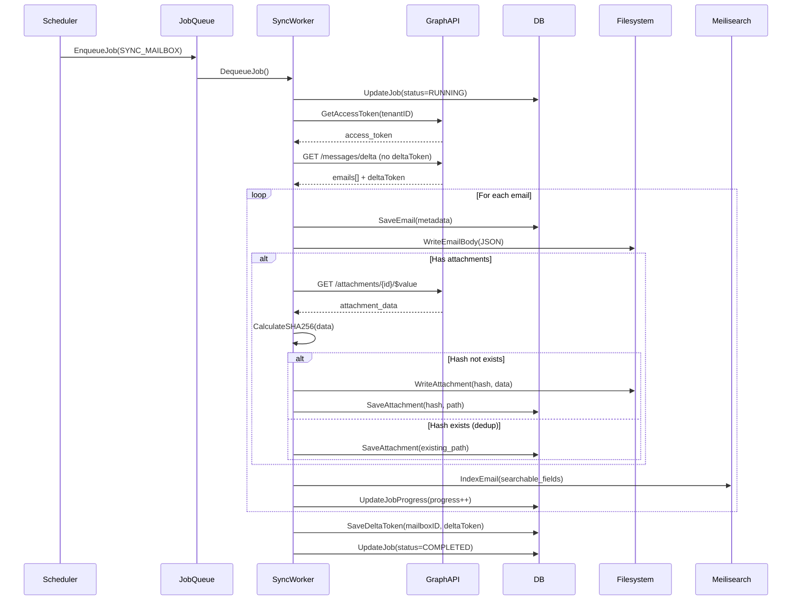
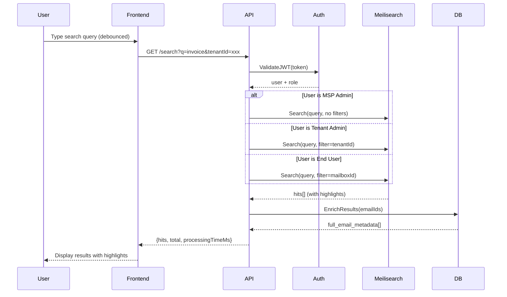
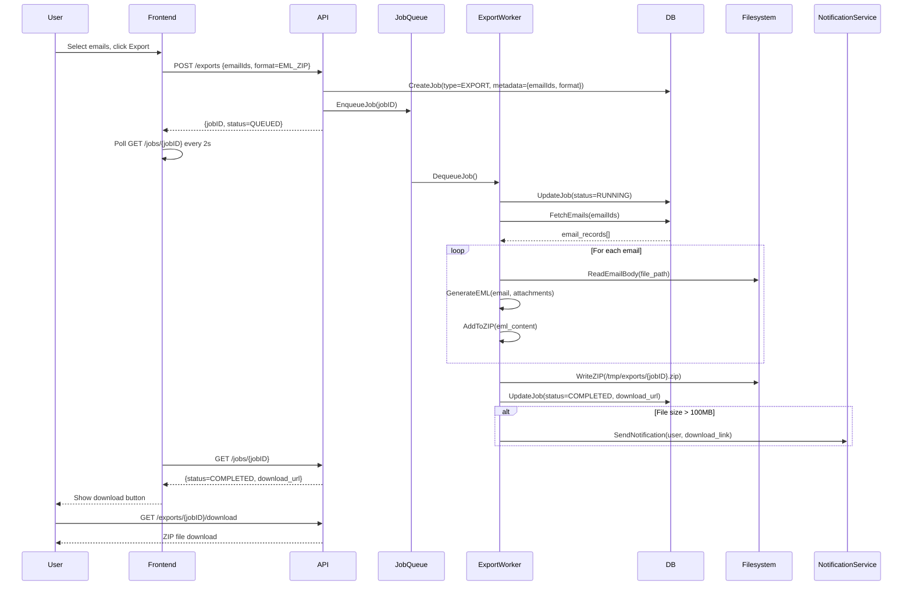
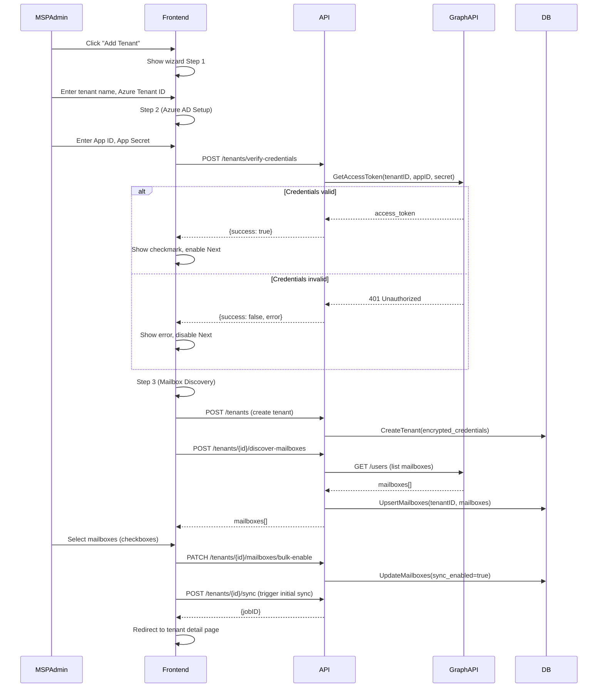

## Core Workflows

### Email Sync Workflow (Initial)

```mermaid
sequenceDiagram
    participant Scheduler
    participant JobQueue
    participant SyncWorker
    participant GraphAPI
    participant DB
    participant FS as Filesystem
    participant Meili as Meilisearch

    Scheduler->>JobQueue: EnqueueJob(SYNC_MAILBOX)
    JobQueue->>SyncWorker: DequeueJob()
    SyncWorker->>DB: UpdateJob(status=RUNNING)

    SyncWorker->>GraphAPI: GetAccessToken(tenantID)
    GraphAPI-->>SyncWorker: access_token

    SyncWorker->>GraphAPI: GET /messages/delta (no deltaToken)
    GraphAPI-->>SyncWorker: emails[] + deltaToken

    loop For each email
        SyncWorker->>DB: SaveEmail(metadata)
        SyncWorker->>FS: WriteEmailBody(JSON)

        alt Has attachments
            SyncWorker->>GraphAPI: GET /attachments/{id}/$value
            GraphAPI-->>SyncWorker: attachment_data
            SyncWorker->>SyncWorker: CalculateSHA256(data)

            alt Hash not exists
                SyncWorker->>FS: WriteAttachment(hash, data)
                SyncWorker->>DB: SaveAttachment(hash, path)
            else Hash exists (dedup)
                SyncWorker->>DB: SaveAttachment(existing_path)
            end
        end

        SyncWorker->>Meili: IndexEmail(searchable_fields)
        SyncWorker->>DB: UpdateJobProgress(progress++)
    end

    SyncWorker->>DB: SaveDeltaToken(mailboxID, deltaToken)
    SyncWorker->>DB: UpdateJob(status=COMPLETED)
```

### Email Search Workflow

```mermaid
sequenceDiagram
    participant User
    participant Frontend
    participant API
    participant Auth
    participant Meili as Meilisearch
    participant DB

    User->>Frontend: Type search query (debounced)
    Frontend->>API: GET /search?q=invoice&tenantId=xxx

    API->>Auth: ValidateJWT(token)
    Auth-->>API: user + role

    alt User is MSP Admin
        API->>Meili: Search(query, no filters)
    else User is Tenant Admin
        API->>Meili: Search(query, filter=tenantId)
    else User is End User
        API->>Meili: Search(query, filter=mailboxId)
    end

    Meili-->>API: hits[] (with highlights)

    API->>DB: EnrichResults(emailIds)
    DB-->>API: full_email_metadata[]

    API-->>Frontend: {hits, total, processingTimeMs}
    Frontend-->>User: Display results with highlights
```

### Export Workflow (EML/ZIP)

```mermaid
sequenceDiagram
    participant User
    participant Frontend
    participant API
    participant JobQueue
    participant ExportWorker
    participant DB
    participant FS as Filesystem
    participant Notify as NotificationService

    User->>Frontend: Select emails, click Export
    Frontend->>API: POST /exports {emailIds, format=EML_ZIP}

    API->>DB: CreateJob(type=EXPORT, metadata={emailIds, format})
    API->>JobQueue: EnqueueJob(jobID)
    API-->>Frontend: {jobID, status=QUEUED}

    Frontend->>Frontend: Poll GET /jobs/{jobID} every 2s

    JobQueue->>ExportWorker: DequeueJob()
    ExportWorker->>DB: UpdateJob(status=RUNNING)

    ExportWorker->>DB: FetchEmails(emailIds)
    DB-->>ExportWorker: email_records[]

    loop For each email
        ExportWorker->>FS: ReadEmailBody(file_path)
        ExportWorker->>ExportWorker: GenerateEML(email, attachments)
        ExportWorker->>ExportWorker: AddToZIP(eml_content)
    end

    ExportWorker->>FS: WriteZIP(/tmp/exports/{jobID}.zip)
    ExportWorker->>DB: UpdateJob(status=COMPLETED, download_url)

    alt File size > 100MB
        ExportWorker->>Notify: SendNotification(user, download_link)
    end

    Frontend->>API: GET /jobs/{jobID}
    API-->>Frontend: {status=COMPLETED, download_url}
    Frontend-->>User: Show download button

    User->>API: GET /exports/{jobID}/download
    API-->>User: ZIP file download
```

### Tenant Onboarding Workflow

```mermaid
sequenceDiagram
    participant MSPAdmin
    participant Frontend
    participant API
    participant GraphAPI
    participant DB

    MSPAdmin->>Frontend: Click "Add Tenant"
    Frontend->>Frontend: Show wizard Step 1
    MSPAdmin->>Frontend: Enter tenant name, Azure Tenant ID

    Frontend->>Frontend: Step 2 (Azure AD Setup)
    MSPAdmin->>Frontend: Enter App ID, App Secret
    Frontend->>API: POST /tenants/verify-credentials

    API->>GraphAPI: GetAccessToken(tenantID, appID, secret)

    alt Credentials valid
        GraphAPI-->>API: access_token
        API-->>Frontend: {success: true}
        Frontend->>Frontend: Show checkmark, enable Next
    else Credentials invalid
        GraphAPI-->>API: 401 Unauthorized
        API-->>Frontend: {success: false, error}
        Frontend->>Frontend: Show error, disable Next
    end

    Frontend->>Frontend: Step 3 (Mailbox Discovery)
    Frontend->>API: POST /tenants (create tenant)
    API->>DB: CreateTenant(encrypted_credentials)

    Frontend->>API: POST /tenants/{id}/discover-mailboxes
    API->>GraphAPI: GET /users (list mailboxes)
    GraphAPI-->>API: mailboxes[]
    API->>DB: UpsertMailboxes(tenantID, mailboxes)
    API-->>Frontend: mailboxes[]

    MSPAdmin->>Frontend: Select mailboxes (checkboxes)
    Frontend->>API: PATCH /tenants/{id}/mailboxes/bulk-enable
    API->>DB: UpdateMailboxes(sync_enabled=true)

    Frontend->>API: POST /tenants/{id}/sync (trigger initial sync)
    API-->>Frontend: {jobID}
    Frontend->>Frontend: Redirect to tenant detail page
```

