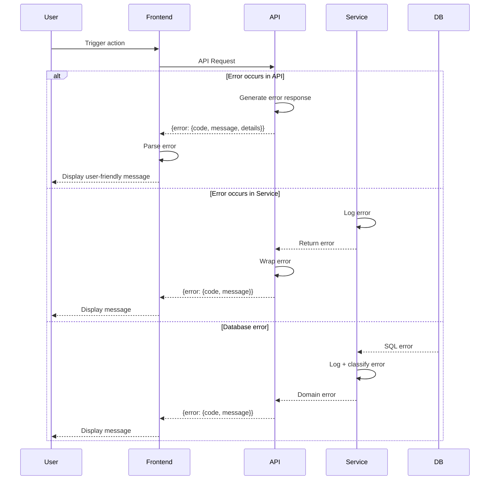

## Error Handling Strategy

### Error Flow



### Error Response Format

```typescript
interface ApiError {
  error: {
    code: string;            // Machine-readable code (e.g., "INVALID_CREDENTIALS")
    message: string;         // Human-readable message
    details?: Record<string, any>;  // Additional context
    timestamp: string;       // ISO 8601 timestamp
    requestId: string;       // For log correlation
  };
}
```

### Frontend Error Handling

```typescript
// lib/services/api-client.ts
async function request<T>(endpoint: string, options: RequestInit): Promise<T> {
  try {
    const response = await fetch(endpoint, options);

    if (!response.ok) {
      const errorData: ApiError = await response.json();
      throw new AppError(
        errorData.error.code,
        errorData.error.message,
        response.status
      );
    }

    return response.json();
  } catch (err) {
    if (err instanceof AppError) throw err;

    // Network error
    throw new AppError('NETWORK_ERROR', 'Unable to reach server', 0);
  }
}
```

### Backend Error Handling

```go
// pkg/errors/errors.go
package errors

type AppError struct {
    Code       string                 `json:"code"`
    Message    string                 `json:"message"`
    Details    map[string]interface{} `json:"details,omitempty"`
    StatusCode int                    `json:"-"`
}

func (e *AppError) Error() string {
    return e.Message
}

func NewBadRequest(message string) *AppError {
    return &AppError{
        Code:       "BAD_REQUEST",
        Message:    message,
        StatusCode: 400,
    }
}

func NewUnauthorized(message string) *AppError {
    return &AppError{
        Code:       "UNAUTHORIZED",
        Message:    message,
        StatusCode: 401,
    }
}

// Global error handler middleware
func ErrorHandler(c *fiber.Ctx, err error) error {
    appErr, ok := err.(*AppError)
    if !ok {
        appErr = &AppError{
            Code:       "INTERNAL_ERROR",
            Message:    "An unexpected error occurred",
            StatusCode: 500,
        }
    }

    return c.Status(appErr.StatusCode).JSON(fiber.Map{
        "error": appErr,
    })
}
```

