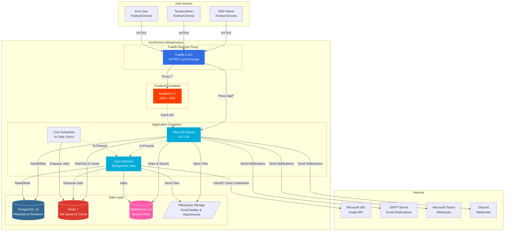

## High Level Architecture

### Technical Summary

IronArchive is architected as a **monolithic fullstack application** with clear separation between backend (Go), frontend (SvelteKit), and supporting services (PostgreSQL, Redis, Meilisearch). The system employs a **multi-tenant SaaS architecture** where MSP Admins manage multiple customer tenants, each with their own M365 mailboxes, while maintaining strict data isolation through application-enforced tenant filtering.

The backend leverages **Go 1.24 with Fiber v3** for high-performance HTTP APIs and background job processing, integrating with **Microsoft Graph API** for email synchronization using delta queries for efficiency. Email data is stored in a **hybrid approach**: metadata and relationships in **PostgreSQL 16**, full message bodies on the filesystem with hierarchical directory structure, searchable content in **Meilisearch** for sub-200ms queries, and background tasks orchestrated via **Redis + asynq** job queues.

The frontend utilizes **SvelteKit 2.x** in hybrid SSR+SPA mode, providing server-side rendering for initial page loads and seamless client-side navigation thereafter. **TailwindCSS 4.x** with a custom theme system enables comprehensive whitelabeling for MSPs to brand the platform for their clients.

Deployment follows **Docker Compose** for single-server orchestration with **Traefik** reverse proxy for automatic HTTPS via Let's Encrypt. This architecture targets **cost-efficiency** (75% reduction vs commercial solutions) while maintaining **enterprise-grade compliance** features (DSGVO/GoBD retention policies, legal holds, immutable audit logs) and **superior performance** (instant search, 10K+ emails/hour sync throughput).

The monolithic v1.0 approach prioritizes **rapid development and operational simplicity** for the initial release, with a clear separation path to microservices post-v1.0 if scale demands (API server, sync workers, job processors as separate containers).

### Platform and Infrastructure Choice

**Platform:** Self-Hosted Docker Compose (Multi-Cloud Compatible)

**Key Services:**
- **Application Container:** Go binary (API server + background workers + job queue consumer)
- **Database:** PostgreSQL 16 with pgcrypto, pg_cron extensions
- **Cache & Job Queue:** Redis 7
- **Search Engine:** Meilisearch 1.6
- **Reverse Proxy:** Traefik 2.10+ (automatic HTTPS, Docker label-based routing)
- **File Storage:** Local filesystem with configurable mount point (supports NFS/SAN for large deployments)

**Deployment Hosts and Regions:**
- **Recommended:** Hetzner Cloud (Nuremberg, Helsinki) or OVH (Gravelines) for European data residency
- **Supported:** AWS EC2, Azure VMs, Google Compute Engine, bare metal servers
- **Multi-Region Strategy:** Each MSP deploys a single instance in their preferred region

### Repository Structure

**Structure:** Monorepo
**Monorepo Tool:** Native Git monorepo (no external tool)
**Package Organization:** Directory-based separation

```
/ironarchive
├── /backend          # Go application (API, workers, sync engine)
│   ├── /cmd          # Application entrypoints
│   ├── /internal     # Private application code
│   └── /pkg          # Public shared packages
├── /frontend         # SvelteKit application
│   ├── /src          # Source code (routes, components, stores)
│   └── /static       # Static assets
├── /docker           # Dockerfile, docker-compose.yml
├── /docs             # Documentation (architecture, PRD, guides)
├── /migrations       # Database schema migrations (golang-migrate)
├── /scripts          # Utility scripts (build, deploy, test)
└── README.md
```

### High Level Architecture Diagram



### Architectural Patterns

- **Monolithic Architecture with Clear Boundaries:** Single deployable Go binary containing API server, background workers, and cron scheduler communicating via in-process channels and Redis queues. Simplifies v1.0 deployment while maintaining logical separation for future microservices extraction. _Rationale:_ Reduces operational complexity, eliminates inter-service network latency, and accelerates development velocity for initial release.

- **Multi-Tenant SaaS with Application-Enforced Isolation:** All database queries filtered by `tenant_id` via middleware/repository pattern. Each tenant's data logically isolated in shared database tables and physically separated on filesystem by directory structure. _Rationale:_ Balances cost-efficiency (shared infrastructure) with security (strict isolation prevents cross-tenant data leaks).

- **Event-Driven Background Job Processing:** Long-running operations (email sync, export generation) processed asynchronously via Redis-backed job queues (asynq library) with retry logic and progress tracking. _Rationale:_ Keeps API responses fast (<500ms), handles rate limits gracefully, and provides fault tolerance for external API interactions.

- **Hybrid Data Storage Strategy:** Relational data (users, tenants, mailboxes) in PostgreSQL for ACID transactions; email metadata in PostgreSQL with full bodies on filesystem for cost-efficiency; searchable content in Meilisearch for performance. _Rationale:_ Optimizes for query speed (search), cost (filesystem cheaper than database BLOB storage), and relational integrity (foreign keys).

- **Repository Pattern for Data Access:** Abstract database operations behind repository interfaces (`UserRepository`, `TenantRepository`, `EmailRepository`) with implementations using pgx or GORM. _Rationale:_ Enables unit testing with mocked repositories, centralizes tenant filtering logic, and provides future flexibility to swap database implementations.

- **API Gateway Pattern (Frontend BFF):** SvelteKit server-side routes act as Backend-for-Frontend, aggregating multiple API calls and handling session management. _Rationale:_ Reduces frontend complexity, minimizes round trips, and enables server-side rendering with authenticated data fetching.

- **Component-Based UI with Atomic Design:** Reusable Svelte components organized by atomic design principles (atoms, molecules, organisms, templates, pages) using Shadcn-Svelte primitives. _Rationale:_ Ensures consistency across whitelabeled instances and accelerates UI development with pre-built accessible components.

- **Outbox Pattern for Notifications:** Critical notifications (sync failures, export completions) written to database `notifications` table alongside business logic in same transaction, then sent asynchronously by separate worker. _Rationale:_ Guarantees notification delivery even if webhook endpoint is temporarily unavailable.

